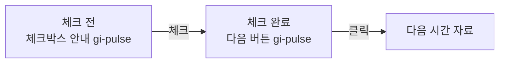

# 필수 체크박스 순차 안내 개선 계획

## 문제

시간 자료 단계에서는 학생이 온도 변화를 확인했다는 체크박스를 먼저 누른 뒤, `다음 시간 단계 열기` 버튼을 눌러야 합니다. 현재는 체크하지 않은 상태에서 버튼만 비활성화되어 있어 첫 행동이 분명하지 않습니다.

## 목표

- 체크하지 않았을 때 체크박스가 있는 안내 줄을 `gi-pulse`로 먼저 강조합니다.
- 체크하면 체크박스 강조를 멈추고, 활성화된 다음 단계 버튼에 `gi-pulse`를 넘깁니다.
- 마지막 시간 자료에서도 같은 흐름으로 `자료 추적 마치기`를 안내합니다.
- 첫 안내 활동의 필수 확인 체크박스에도 같은 순차 안내를 적용합니다.
- 체크 상태와 다음 버튼 상태는 텍스트·포커스·키보드 조작으로도 이해할 수 있게 유지합니다.

## 상태 흐름

## 구현 범위

1. `ModelGuide`와 `ScenarioFlow`의 필수 체크 행에 준비 상태별 `gi-pulse` 클래스를 연결합니다.
2. 체크 행에도 아우라·테두리 효과가 보이도록 공통 CSS를 보강합니다.
3. `prefers-reduced-motion`에서는 애니메이션 없이 정적 강조를 유지합니다.
4. E2E에서 체크 전/후에 강조 대상이 체크 행에서 다음 버튼으로 이동하는지 검증합니다.

## 검증

- 체크 전: 체크 행에 `gi-pulse`, 다음 버튼에는 없음.
- 체크 후: 체크 행에는 없음, 활성화된 다음 버튼에 `gi-pulse`.
- 마지막 시간 자료에서도 동일한 상태 전환 확인.
- `npm test`, `npm run lint`, `npm run test:e2e` 실행.

