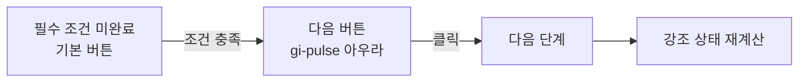

# 단계 진행 버튼 주목 효과 개선 계획

## 배경

3단계에서 확인 체크를 한 뒤에도 다음 단계 버튼이 일반 버튼처럼 보여, 학생이 무엇을 눌러야 하는지 다시 찾는 상황이 생겼습니다. 프로젝트 전체 학습 흐름을 살펴보고, **현재 단계의 필수 완료 조건을 만족했을 때 다음 단계로 이동시키는 버튼**을 `gi-pulse` 계열의 부드러운 아우라 효과로 강조합니다.

## 목표

- 학생이 지금 눌러야 할 버튼을 한눈에 알아차리게 합니다.
- 아직 조건을 만족하지 않은 버튼은 과도하게 깜빡이지 않게 합니다.
- 키보드 사용자와 모션에 민감한 사용자에게도 읽기 쉽고 안전하게 제공합니다.
- 효과는 장식용이 아니라 단계 진행 상태와 연결합니다.

## 적용 대상

| 학습 흐름 | 필수 조건 | 강조할 다음 행동 |
| --- | --- | --- |
| 안내 활동 | 방향 예측 + 안내 확인 | 첫 사건 시작하기 |
| 시간 자료 보기 | 현재 시간 자료 확인 | 다음 시간 단계 열기 |
| 시간 자료 마지막 | 마지막 자료 확인 | 자료 추적 마치기 |
| 방식과 근거 | 열 이동 방식·근거 선택 | 결과 확인 |
| 결과 화면 | 필수 입력 완료 | 다음 사건으로 / 전체 활동 마무리 |
| 완료 화면 | 필수 조건 없음 | 다시 시작은 선택 행동이므로 기본 강조 없음 |

## 상태 흐름

## 구현 방향

1. 공유 CSS 애니메이션(`gi-pulse`)과 접근성 대응(`prefers-reduced-motion`)을 추가합니다.
2. 기존 단계별 완료 조건을 재사용해 준비 상태를 계산합니다.
3. 준비된 다음 단계 버튼에만 `gi-pulse` 클래스와 보조 텍스트를 적용합니다.
4. 헤더·도움말·업데이트 버튼에는 효과를 적용하지 않습니다.
5. 3단계의 `자료 추적 마치기`를 우선 검증하고, 다른 필수 진행 버튼도 같은 규칙으로 일관되게 처리합니다.

## 검증

- 단위/렌더 테스트: 조건 전후 `gi-pulse` 클래스 결정.
- E2E: 조건을 충족하면 강조 버튼이 나타나고 클릭 후 다음 단계로 이동.
- 접근성: `prefers-reduced-motion: reduce`에서도 텍스트 안내와 포커스 링이 유지.
- 시각 확인: 데스크톱과 작은 화면에서 버튼이 잘리지 않고 강조가 과하지 않은지 확인.
